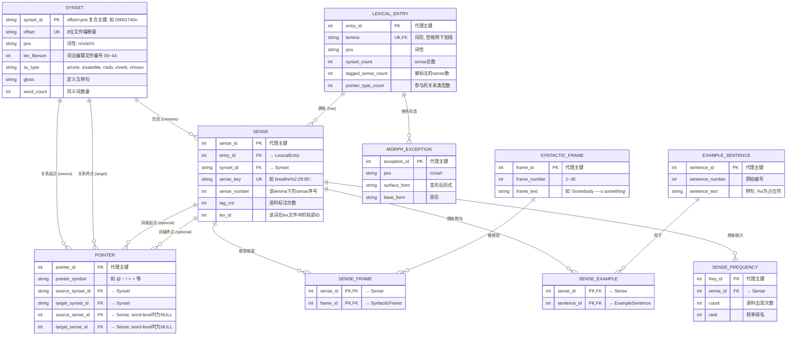

# WordNet 3.1 数据库文件结构详解

> 数据来源：Princeton University WordNet 3.1 (`https://wordnet.princeton.edu/download/current-version#win`)  
> 本文基于 `dict/` 目录下的原始数据库文件进行分析。

---

## 一、整体架构

WordNet 3.1 数据库采用**纯文本文件**存储，按词性（POS: Part of Speech）分文件组织。核心设计理念是 **Synset（同义词集）**：每个 synset 由一组语义等价或近义的词组成，并带有唯一的偏移量（offset）作为全局 ID。

### 1.1 文件分类总览

```
dict/
├── 核心数据文件（运行时必需）
│   ├── data.noun      # 名词 synset 定义与关系
│   ├── data.verb      # 动词 synset 定义与关系
│   ├── data.adj       # 形容词 synset 定义与关系
│   ├── data.adv       # 副词 synset 定义与关系
│   ├── index.noun     # 名词词形 → synset 索引
│   ├── index.verb     # 动词词形 → synset 索引
│   ├── index.adj      # 形容词词形 → synset 索引
│   ├── index.adv      # 副词词形 → synset 索引
│   ├── index.sense    # Sense Key → synset 映射（语料标注用）
│   ├── cntlist        # 各 sense 的语料频率统计
│   ├── cntlist.rev    # 频率统计（反向格式）
│   ├── noun.exc       # 不规则名词形态
│   ├── verb.exc       # 不规则动词形态
│   ├── adj.exc        # 不规则形容词形态
│   ├── adv.exc        # 不规则副词形态
│   └── cousin.exc     # （空文件，预留）
│
├── 动词句法框架文件
│   ├── verb.Framestext    # 35 种标准句法框架模板
│   ├── sentidx.vrb        # 动词 sense → 例句模板编号
│   └── sents.vrb          # 例句文本库
│
└── 构建源文件（仅重新构建时需要）
    └── dbfiles/         # grind 编译器的原始输入
        ├── noun.Tops    # 顶层概念（entity）
        ├── noun.act ~ noun.time   # 按主题细分的名词源文件
        ├── adj.all / adj.pert / adj.ppl
        ├── adv.all
        ├── verb.body ~ verb.weather
        └── cntlist
```

### 1.2 构建流程

```
  dbfiles/ (词法编纂源文件)
      │
      ▼
 [ grind 工具编译 ]  ←── log.grind.3.1 (构建日志)
      │
      ├──► data.*    ──┐
      ├──► index.*   ──┼──► 应用程序/库直接读取
      ├──► index.sense─┘
      ├──► *.exc / cntlist / verb.Framestext / ...
```

---

## 二、关系数据库概念模型（ER 图）

将 WordNet 3.1 的文本文件映射为关系数据库时，可抽象出以下实体与关系。下图采用 **Mermaid ER Diagram** 语法描述，可在支持 Mermaid 的 Markdown 阅读器中直接渲染。

### 2.1 ER 图（Mermaid）



### 2.2 实体说明

| 实体 | 对应文件 | 说明 |
|------|----------|------|
| **Synset** | `data.*` | 同义词集是 WordNet 的核心。主键建议用 `offset` + `pos` 的复合键，因为不同 `data.*` 文件中可能出现相同的 offset 值（虽然 Princeton 的 grind 工具通常保证全局唯一，但按词性隔离更安全）。 |
| **LexicalEntry** | `index.*` | 一个 lemma + pos 的组合。同一个词形在不同词性中视为不同词条（如 `run` 在名词和动词中各有一条记录）。 |
| **Sense** | `index.sense` + `data.*` 中的词列表 | 连接 LexicalEntry 与 Synset 的**关联实体**。同一个 lemma 在不同 synset 中出现时，每条都是一个独立的 Sense。`sense_key` 是全局唯一标识符。 |
| **Pointer** | `data.*` 中的指针字段 | 描述 Synset 之间（或 Sense 之间）的语义关系。当 `source_sense_id` / `target_sense_id` 为 NULL 时，表示 **Synset 级关系**（如 `dog @ animal`）；非 NULL 时表示 **Word 级关系**（如 `breathe + breath` 中派生词可能精确到具体词形）。 |
| **SyntacticFrame** | `verb.Framestext` | 动词的 35 种标准句法框架模板。 |
| **SenseFrame** | `data.verb` 末尾的 frame 编码 | 多对多关联：某个动词的特定 sense 可以使用多种句法框架。 |
| **ExampleSentence** | `sents.vrb` | 动词例句文本库。 |
| **SenseExample** | `sentidx.vrb` | 多对多关联：某个 sense 可以对应多条例句编号。 |
| **MorphException** | `*.exc` | 不规则形态变化表。 |
| **SenseFrequency** | `cntlist` | 各 sense 在 SemCor 等语料中的频率统计。 |

### 2.3 关系基数（Cardinality）详解

| 关系 | 基数 | 说明 |
|------|:----:|------|
| `Synset` ── `Sense` | **1 : N** | 一个 synset 包含多个词形（如 `{breathe, respire, take_a_breath, suspire}`），每个词形在该 synset 中对应一条 Sense 记录。 |
| `LexicalEntry` ── `Sense` | **1 : N** | 一个词项（如动词 `breathe`）在字典中只有 1 个 sense，对应 1 条 Sense 记录；而 `abandon` 有 5 个 senses，对应 5 条记录。 |
| `Synset` ── `Pointer` (source) | **1 : N** | 一个 synset 可以是多条关系的起点（如 `entity` 有 3 条 hyponym 指针）。 |
| `Synset` ── `Pointer` (target) | **1 : N** | 一个 synset 也可以是多条关系的终点（如 `animal` 被多个下位词指向）。 |
| `Sense` ── `Pointer` (word-level) | **0..1 : 0..N** | 大多数指针是 synset 级的，不涉及具体 sense；少数 word-level 指针（如 `+` 派生关系）会精确到 synset 中的第几个词。 |
| `Sense` ── `SyntacticFrame` | **N : M** | 通过 `SenseFrame` 关联表实现多对多。如 `breathe` 既可用 "Somebody ----s" 框架，也可用 "Somebody ----s something" 框架。 |
| `Sense` ── `ExampleSentence` | **N : M** | 通过 `SenseExample` 关联表实现多对多。 |
| `LexicalEntry` ── `MorphException` | **1 : N** | 一个词项可有多条不规则变形（如 `go` → `went`, `gone`）。 |

### 2.4 建模要点与陷阱

1. **offset 不能单独做主键**  
   虽然 grind 工具生成的 offset 在全部 `data.*` 文件间通常是全局唯一的，但按 WordNet 设计规范，offset 本质是**文件内的字节偏移量**。因此最严谨的做法是使用 **`offset + pos`** 作为复合主键，或引入代理主键。

2. **Sense 是核心关联枢纽**  
   几乎所有查询都要通过 `Sense` 表：
   - 查一个词的所有释义 → `LexicalEntry` → `Sense` → `Synset`
   - 查一个 synset 的所有同义词 → `Synset` → `Sense` → `LexicalEntry`
   - 查词频 → `SenseFrequency` → `Sense`
   - 查例句/框架 → `Sense` → `SenseExample` / `SenseFrame`

3. **Pointer 的自反性**  
   `Pointer` 表是一个**自反关系表**（连接同一实体 `Synset` 的两个实例）。在 SQL 中需要两个外键都指向 `Synset` 表。同时支持 word-level 精确关联时，需要额外引入对 `Sense` 表的引用。

4. **形容词卫星的特殊性**  
   形容词卫星（ss_type=`s`）在 `data.adj` 中存储，但它通过 `&` 指针依赖一个核心形容词（ss_type=`a`）。在 Sense 表中，卫星形容词的 `sense_key` 包含 `head_word:head_id`（如 `0%5:00:00:cardinal:00`），这可以作为外键指向核心形容词的 Sense 记录。

5. **Domain 关系的双向性**  
   `;c`（domain category）和 `-c`（domain member category）是**同一对关系**的两个方向。在关系模型中，两者都存储为 `Pointer` 记录，仅 `pointer_symbol` 不同。查询时可以通过反向查找实现双向导航。

---

## 三、核心文件格式详解

### 2.1 `data.*` — Synset 定义文件

每个词性一个文件。每行代表一个 **synset**（同义词集）。前 29 行为许可证声明，从第 30 行开始为数据。

#### 格式语法

```
<offset> <lex_filenum> <ss_type> <w_cnt> <word> <lex_id>... <p_cnt> [<ptr> <pos> <target_offset> <target_pos> <source/target>]... | <gloss>
```

| 字段 | 说明 | 示例 |
|------|------|------|
| `offset` | 该 synset 在文件中的字节偏移量，**8 位数字，作为全局唯一 ID** | `00001740` |
| `lex_filenum` | 词法编纂文件编号（语义类别） | `03` = noun.Tops, `29` = verb.body |
| `ss_type` | 同义词集类型 | `n`=名词, `v`=动词, `a`=形容词, `r`=副词, `s`=形容词卫星 |
| `w_cnt` | 该 synset 中包含的词形数量（16 进制） | `01`~`19` |
| `word lex_id` | 词形 + 词在该文件中的局部 ID | `entity 0` |
| `p_cnt` | 指针（关系）数量 | `003` |
| `ptr pos target_offset ...` | 关系类型 + 目标词性 + 目标偏移量 + 源/目标词序号 | `~ 00001930 n 0000` |
| `\| gloss` | 定义（gloss），可包含例句 | `that which is perceived...` |

#### 名词示例：`entity` (offset `00001740`)

```
00001740 03 n 01 entity 0 003 ~ 00001930 n 0000 ~ 00002137 n 0000 ~ 04431553 n 0000 | that which is perceived or known or inferred to have its own distinct existence (living or nonliving)
```

拆解：
- `00001740`：offset ID
- `03`：lexicographer file = noun.Tops
- `n`：名词
- `01 entity 0`：包含 1 个词形 "entity"
- `003`：3 个指针
- `~ 00001930 n 0000`：下位词 → `physical_entity`
- `~ 00002137 n 0000`：下位词 → `abstraction`
- `~ 04431553 n 0000`：下位词 → `thing`
- `|` 后：定义文本

#### 动词示例：`breathe` (offset `00001740`)

```
00001740 29 v 04 breathe 0 take_a_breath 0 respire 0 suspire 3 021 * 00005041 v 0000 * 00004227 v 0000 + 03121972 a 0301 + 00832852 n 0303 ... 02 + 02 00 + 08 00 | draw air into, and expel out of, the lungs; "I can breathe better when the air is clean"; "The patient is respiring"
```

拆解：
- `00001740`：offset ID
- `29`：lexicographer file = verb.body
- `v`：动词
- `04 breathe 0 take_a_breath 0 respire 0 suspire 3`：4 个同义词，其中 suspire 的 lex_id=3
- `021`：21 个指针
- `* 00005041 v 0000`：蕴含(entailment) → `inhale`
- `* 00004227 v 0000`：蕴含(entailment) → `exhale`
- `+ 03121972 a 0301`：派生关系 → 形容词 `respiratory`
- `+ 00832852 n 0303`：派生关系 → 名词 `breath`
- `02 + 02 00 + 08 00`：句法框架编号（对应 verb.Framestext 中的模板）

#### 形容词示例：`able` (offset `00001740`)

```
00001740 00 a 01 able 0 005 = 05207437 n 0000 = 05624029 n 0000 + 05624029 n 0101 + 05207437 n 0101 ! 00002098 a 0101 | (usually followed by `to') having the necessary means...
```

拆解：
- `00`：lexicographer file = adj.all
- `a`：核心形容词（head synset）
- `! 00002098 a 0101`：反义词 → `unable`
- `= 05207437 n 0000`：属性关系 → 名词 `ability`
- `+ 05624029 n 0101`：派生关系 → 名词 `ability`

#### 副词示例：`a_cappella` (offset `00001740`)

```
00001740 02 r 02 a_cappella 0 a_capella 0 002 \ 02260096 a 0202 \ 02260096 a 0101 | without musical accompaniment; "they performed a cappella"
```

拆解：
- `r`：副词
- `\ 02260096 a 0202`：pertainym（派生自形容词）→ `a_cappella` (adj)

---

### 2.2 `index.*` — 词形索引文件

用于从 **lemma（词形）** 快速定位到所有相关的 synset offset。

#### 格式语法

```
<lemma> <pos> <synset_cnt> <p_cnt> [<ptr_symbol>...] <sense_cnt> <tagsense_cnt> [<offset>...]
```

| 字段 | 说明 |
|------|------|
| `lemma` | 词形（小写，空格用下划线代替） |
| `pos` | 词性（n/v/a/r） |
| `synset_cnt` | 该词在字典中不同 synset 的数量（即 sense 数量） |
| `p_cnt` | 该词参与的关系类型数量 |
| `ptr_symbol...` | 该词在 data 文件中出现的所有指针类型符号列表 |
| `sense_cnt` | 同 synset_cnt |
| `tagsense_cnt` | 在 SemCor 语料中被标注过的 sense 数量 |
| `offset...` | 该词所属每个 synset 在 data 文件中的偏移量列表 |

#### 示例：`index.verb` 中的 `abandon`

```
abandon v 5 4 @ ~ $ + 5 5 02232813 02232523 02080923 00614907 00615748
```

拆解：
- `abandon`：词形
- `v`：动词
- `5`：5 个 sense（在 5 个不同 synset 中出现）
- `4`：涉及 4 种指针类型
- `@ ~ $ +`：出现过的指针类型 = hypernym, hyponym, verb_group, derivation
- `5 5`：5 个 senses，5 个被标注过
- `02232813 ...`：5 个 synset 的 offset

---

### 2.3 `index.sense` — Sense 索引

连接 **Sense Key** 与 **synset offset** 的核心映射文件，主要用于语料标注（如 SemCor）和词义消歧。

#### 格式语法

```
<sense_key> <offset> <sense_number> <tag_cnt>
```

| 字段 | 说明 |
|------|------|
| `sense_key` | `lemma%ss_type:lex_filenum:lex_id[:head_word:head_id]` |
| `offset` | 对应 synset 在 data 文件中的偏移量 |
| `sense_number` | 该 sense 在该 lemma 所有 senses 中的序号（从 1 开始） |
| `tag_cnt` | 在语料中的出现次数（0 = 未标注） |

#### Sense Key 编码规则

```
lemma%ss_type:lex_filenum:lex_id:head_word:head_id
```

- `ss_type`：词性数字编码  
  `1`=noun, `2`=verb, `3`=adj, `4`=adv, `5`=adj satellite
- `lex_filenum`：词法编纂文件编号
- `lex_id`：该词在该文件中的局部序号（00~99）
- `head_word:head_id`：**仅形容词卫星**需要，指向其核心形容词（head synset）

#### 示例

```
'hood%1:15:00:: 08659519 1 0
```
- `'hood`：词形
- `%1:15:00::`：名词(1)，lex file 15 (noun.location)，lex_id=00
- `08659519`：对应 synset offset
- `1`：该词的第 1 个 sense
- `0`：未在语料中标注

```
0%5:00:00:cardinal:00 02193771 1 3
```
- `0`：词形
- `%5:00:00:cardinal:00`：**形容词卫星**(5)，head_word=`cardinal`，head_id=00
- `02193771`：对应 synset offset
- `1`：第 1 个 sense
- `3`：在语料中出现 3 次

---

## 四、实体间关系（指针类型）完整明细

WordNet 中 synset 之间的关系通过 **指针（pointer）** 表示。下表列出所有指针符号及其语义。

### 3.1 通用关系（名词/动词/形容词/副词共有）

| 符号 | 名称 | 适用词性 | 方向 | 说明 | 示例 |
|:----:|------|:--------:|:----:|------|------|
| `!` | **ANTONYM** | adj, adv | ↔ | 反义词 | `able ! unable` |
| `@` | **HYPERNYM** | noun, verb | ↑ | 上位词（is-a 关系） | `dog @ animal` |
| `@i` | **INSTANCE HYPERNYM** | noun | ↑ | 实例上位词 | `Einstein @i physicist` |
| `~` | **HYPONYM** | noun, verb | ↓ | 下位词 | `animal ~ dog` |
| `~i` | **INSTANCE HYPONYM** | noun | ↓ | 实例下位词 | `physicist ~i Einstein` |
| `#m` | **MEMBER MERONYM** | noun | ← | 成员部分 | `flock #m bird` |
| `#s` | **SUBSTANCE MERONYM** | noun | ← | 物质部分 | `steel #s iron` |
| `#p` | **PART MERONYM** | noun | ← | 部件部分 | `car #p engine` |
| `%m` | **MEMBER HOLONYM** | noun | → | 成员整体 | `bird %m flock` |
| `%s` | **SUBSTANCE HOLONYM** | noun | → | 物质整体 | `iron %s steel` |
| `%p` | **PART HOLONYM** | noun | → | 部件整体 | `engine %p car` |
| `=` | **ATTRIBUTE** | adj, noun | ↔ | 属性（adj↔noun） | `beautiful = beauty` |
| `+` | **DERIVATION** | noun, verb, adj, adv | ↔ | 派生关系（跨词性） | `breathe + breath` |
| `;c` | **DOMAIN CATEGORY** | n,v,adj,adv | → | 领域-类别 | `cell ;c biology` |
| `;r` | **DOMAIN REGION** | n,v,adj,adv | → | 领域-区域 | `tokyo ;r japan` |
| `;u` | **DOMAIN USAGE** | n,v,adj,adv | → | 领域-用法 | `aint ;u slang` |
| `-c` | **DOMAIN MEMBER CAT** | n,v,adj,adv | ← | 属于某类别领域 | `biology -c cell` |
| `-r` | **DOMAIN MEMBER REG** | n,v,adj,adv | ← | 属于某区域领域 | `japan -r tokyo` |
| `-u` | **DOMAIN MEMBER USG** | n,v,adj,adv | ← | 属于某用法领域 | `slang -u aint` |
| `^` | **ALSO SEE** | verb, adj | ↔ | 参见（语义关联） | `kill ^ slay` |

### 3.2 形容词特有关系

| 符号 | 名称 | 说明 | 示例 |
|:----:|------|------|------|
| `&` | **SIMILAR TO** | 形容词卫星 ↔ 核心形容词 | `nascent & emergent` |
| `\` | **PERTAINYM** | 派生/关联名词（adj↔noun） | `monthly \ month` |
| `<` | **PARTICIPLE OF VERB** | 分词 ↔ 动词 | `running < run` |

> 注：形容词卫星（ss_type=`s`）通过 `&` 指向核心形容词（ss_type=`a`），核心形容词没有 `&` 指针。

### 3.3 动词特有关系

| 符号 | 名称 | 说明 | 示例 |
|:----:|------|------|------|
| `*` | **ENTAILMENT** | 蕴含（做A必然做B） | `sneeze * exhale` |
| `>` | **CAUSE** | 致使（做A导致B发生） | `kill > die` |
| `$` | **VERB GROUP** | 同一语义组的动词 | `breathe $ respire` |

### 3.4 关系方向速查

```
上位/下位：      @ (hypernym)  ←──→  ~ (hyponym)
实例关系：       @i            ←──→  ~i
整体/部分：      #m/#s/#p      ←──→  %m/%s/%p
领域：           ;c/;r/;u      ←──→  -c/-r/-u
反义：           !             ←──→  !
属性：           =             ←──→  =
派生：           +             ←──→  +
蕴含：           *             ────→  (单向)
致使：           >             ────→  (单向)
动词组：         $             ←──→  $
参见：           ^             ←──→  ^
相似：           &             ←──→  (卫星→核心)
```

---

## 五、辅助文件详解

### 4.1 `*.exc` — 形态学例外文件

用于处理**不规则**的词形变化，格式为 `变形形式 原形`。

**`noun.exc`**（不规则复数）：
```
aardwolves aardwolf
abaci abacus
addenda addendum
```

**`verb.exc`**（不规则时态/分词）：
```
abetted abet
abode abide
accompanied accompany
```

**`adj.exc`**（不规则比较级/最高级）：
```
angrier angry
angriest angry
airier airy
```

**`adv.exc`**（不规则副词比较级）：
```
best well
better well
farther far
```

### 4.2 `cntlist` / `cntlist.rev` — 词频统计

按语料出现频率降序排列：

```
10742 be%2:42:03:: 1
 6833 person%1:03:00:: 1
 3019 be%2:42:06:: 2
```

格式：`count sense_key rank`

### 4.3 动词句法框架

**`verb.Framestext`** — 35 种标准句法模板：
```
1	1  Something ----s
2	2  Somebody ----s
8	8  Somebody ----s something
```

**`sentidx.vrb`** — 动词 sense → 例句模板映射：
```
abash%2:37:00:: 126,127
```

**`sents.vrb`** — 例句文本（`%s` 为动词占位符）：
```
1 The children %s to the playground
10 The cars %s down the avenue
```

---

## 六、完整查询示例

以动词 **"breathe"** 为例，展示如何跨文件追踪完整信息。

### Step 1：从 `index.verb` 找到 offsets

```
breathe v 1 4 * $ @ ~ + 1 1 00001740
```
- `breathe` 在字典中只有 **1 个 sense**
- 对应的 synset offset 为 `00001740`

### Step 2：从 `data.verb` 读取完整 synset

```
00001740 29 v 04 breathe 0 take_a_breath 0 respire 0 suspire 3 021 \
  * 00005041 v 0000        ← entailment: inhale
  * 00004227 v 0000        ← entailment: exhale
  + 03121972 a 0301        ← derivation: respiratory (adj)
  + 00832852 n 0303        ← derivation: breath (noun)
  + 04087945 n 0301        ← derivation: breath (noun, another)
  ...
  02 + 02 00 + 08 00       ← syntax frames
  | draw air into, and expel out of, the lungs; \
    "I can breathe better when the air is clean"; \
    "The patient is respiring"
```

**同义词**：breathe, take_a_breath, respire, suspire  
**上位词**：无（顶级概念，verb.body 类别）  
**蕴含**：inhale（吸气）, exhale（呼气）  
**派生**：respiratory (adj), breath (noun)  
**句法**：框架 02, 08

### Step 3：从 `verb.Framestext` 解析句法

```
2  Somebody ----s
8  Somebody ----s something
```
对应例句："The patient **breathes**" / "The patient **breathes** air"

### Step 4：从 `index.sense` 确认 sense key

```
breathe%2:29:00:: 00001740 1 0
```
- ss_type=2 (verb), lex file=29 (verb.body), lex_id=00
- offset=`00001740`，sense number=1，未标注

### Step 5：追踪到上位网络（示例）

```
breathe (00001740)
    ↓ (no hypernym, top of verb.body)
```

对比名词 **"entity"** 的层级：

```
entity (00001740)
    ├─→ physical_entity (00001930)
    │       ├─→ object (00002684)
    │       │       ├─→ whole (00003553)
    │       │       │       └─→ living_thing (00004258)
    │       │       │               └─→ organism (00004475)
    │       │       │                       └─→ animal (00015568)
    │       │       │                               └─→ dog (...)
    │       └─→ causal_agent (00007347)
    │               └─→ person (00007846)
    └─→ abstraction (00002137)
```

---

## 七、统计数据

根据 `log.grind.3.1`，WordNet 3.1 的整体规模：

| 指标 | 数量 |
|------|------|
| 名词 synset | 82,192 |
| 动词 synset | 13,789 |
| 核心形容词 synset | 3,807 |
| 副词 synset | 3,625 |
| Pertainym synset | 3,661 |
| 形容词卫星 synset | 10,717 |
| **Synset 总计** | **117,791** |
| 指针（关系）总计 | 225,204 |
| 同义词（词形出现）总计 | 207,272 |
| 唯一词形 | 147,478 |
| 长度 1 的词形 | 83,253 |
| 长度 2 的词形 | 54,562 |
| 定义（gloss）总计 | 117,791 |

---

## 八、附录：Lexicographer File 编号对照表

| 编号 | 文件名 | 语义类别 |
|:----:|--------|----------|
| 00 | adj.all | 泛形容词 |
| 01 | adj.pert | Pertainym 形容词 |
| 02 | adv.all | 泛副词 |
| 03 | noun.Tops | 顶层抽象概念 |
| 04 | noun.act | 行为/活动 |
| 05 | noun.animal | 动物 |
| 06 | noun.artifact | 人工制品 |
| 07 | noun.attribute | 属性 |
| 08 | noun.body | 身体部位 |
| 09 | noun.cognition | 认知/思维 |
| 10 | noun.communication | 交流 |
| 11 | noun.event | 事件 |
| 12 | noun.feeling | 情感 |
| 13 | noun.food | 食物 |
| 14 | noun.group | 群体 |
| 15 | noun.location | 地点 |
| 16 | noun.motive | 动机 |
| 17 | noun.object | 物体 |
| 18 | noun.person | 人物 |
| 19 | noun.phenomenon | 现象 |
| 20 | noun.plant | 植物 |
| 21 | noun.possession | 财产 |
| 22 | noun.process | 过程 |
| 23 | noun.quantity | 数量 |
| 24 | noun.relation | 关系 |
| 25 | noun.shape | 形状 |
| 26 | noun.state | 状态 |
| 27 | noun.substance | 物质 |
| 28 | noun.time | 时间 |
| 29 | verb.body | 身体动作 |
| 30 | verb.change | 变化 |
| 31 | verb.cognition | 认知动作 |
| 32 | verb.communication | 交流动作 |
| 33 | verb.competition | 竞争动作 |
| 34 | verb.consumption | 消费动作 |
| 35 | verb.contact | 接触动作 |
| 36 | verb.creation | 创造动作 |
| 37 | verb.emotion | 情感动作 |
| 38 | verb.motion | 运动 |
| 39 | verb.perception | 感知 |
| 40 | verb.possession | 拥有 |
| 41 | verb.social | 社交 |
| 42 | verb.stative | 状态动词 |
| 43 | verb.weather | 天气 |
| 44 | adj.ppl | 过去分词形容词 |


---

## 九、查询工具使用指南

本章以 **`main.py`** 查询工具的实际输出为例，逐字段解释每个术语的含义。该工具实现了对 WordNet 3.1 数据库所有核心文件的**全引用追踪**，查询一个单词时会同时检索：`index.*`、`data.*`、`index.sense`、`cntlist`、`*.exc`、`verb.Framestext`、`sentidx.vrb`、`sents.vrb`。

---

### 9.1 启动与命令格式

```
py main.py
[正在加载 WordNet 3.1 数据库...]
[加载完成] 117791 synsets, 155467 index entries, 207235 senses
======================================================================
  WordNet 3.1 查询工具
  命令: <word> [n|v|a|r]    例: dog n | run v | happy a
        q / quit / exit     退出
======================================================================

wn> dog
  共找到 8 个 sense(s)
```

| 输出 | 含义 |
|------|------|
| `117791 synsets` | 从 `data.*` 加载的同义词集总数 |
| `155467 index entries` | 从 `index.*` 加载的唯一词形-词性组合数（如 `dog:n`、`dog:v` 各算一条） |
| `207235 senses` | 从 `index.sense` 加载的 sense 键总数（一个词形在多个 synset 中各算一个 sense） |
| `<word> [n|v|a|r]` | 命令格式：`n`=名词, `v`=动词, `a`=形容词, `r`=副词。省略词性则查询所有词性 |
| `共找到 8 个 sense(s)` | `dog` 在全部 4 个 `index.*` 中共命中 8 个 sense（7 个名词 + 1 个动词） |

---

### 9.2 Sense 头部信息

```
======================================================================
  dog  [名词]  (offset: 02086723)
======================================================================
```

| 字段 | 来源文件 | 说明 |
|------|----------|------|
| `dog` | `index.noun` | lemma（词形），经过去空格下划线化后的标准形式 |
| `[名词]` | `data.noun` 的 `ss_type` | 词性中文名称，`n`=名词, `v`=动词, `a`=形容词, `r`=副词, `s`=形容词卫星 |
| `offset: 02086723` | `data.noun` 行首字段 | 该 synset 在数据文件中的字节偏移量，**全局唯一标识符**。格式为 `offset` + `pos`，如 `02086723n` |

> 同一个 `offset` 值在不同 `data.*` 中可能重复（如 `00001740` 同时出现在 `data.noun` 和 `data.verb`），因此**必须配合 `pos` 才能唯一确定一个 synset**。

---

### 9.3 【词形】

```
【词形】
  lemma: dog
  pos:   n (名词)
  ss_type: n (名词)
  lex_file: 05
```

| 字段 | 来源 | 说明 |
|------|------|------|
| `lemma` | `index.noun` 行首 | 查询词的标准形式。如果输入了不规则变形（如 `went`），工具会先查 `verb.exc` 找到原形 `go` 再查询 |
| `pos` | `index.noun` 第 2 列 | 词性代码及其全称 |
| `ss_type` | `data.noun` 第 3 列 | 同义词集类型。`n/v/a/r` 是核心类型；形容词还有 `s`（卫星形容词），表示它依附于某个 `a` 类型的核心形容词 |
| `lex_file` | `data.noun` 第 2 列 | 词法编纂文件编号。`05` 对应 `noun.animal`（见附录七）。这表示该 synset 属于"动物"语义类别 |

---

### 9.4 【同义词集 Synset】

```
【同义词集 Synset】
  dog (lex_id=0)  |  domestic_dog (lex_id=0)  |  Canis_familiaris (lex_id=0)
```

| 字段 | 来源 | 说明 |
|------|------|------|
| `dog`, `domestic_dog`, `Canis_familiaris` | `data.noun` 中 `w_cnt` 之后的词列表 | 该 synset 中包含的所有同义词（synonyms）。它们在这个语境下语义等价 |
| `lex_id` | `data.noun` 中每个词后的数字 | 该词在其所属 **lexicographer file**（如 `noun.animal`）中的局部序号（0~15 的十六进制）。用于构造 sense key |

> **Synset** 是 WordNet 的核心概念：一个 synset 不是单个"词"，而是一组语义等价的词形构成的集合，共享同一个定义和同一条语义关系网。

---

### 9.5 【当前 Sense】

```
【当前 Sense】
  sense_key:    dog%1:05:00::
  sense_number: 1
  lex_id:       0
  tag_count:    42
```

| 字段 | 来源 | 说明 |
|------|------|------|
| `sense_key` | `index.sense` | 全局唯一的词义标识符。格式：`lemma%ss_type:lex_filenum:lex_id[:head_word:head_id]`。例中 `%1:05:00::` 表示：名词(1)、lex_file=05(noun.animal)、lex_id=00。这是连接外部语料库（如 SemCor）的桥梁 |
| `sense_number` | `index.sense` 第 3 列 | 该 sense 在该 lemma 所有 senses 中的排序（从 1 开始）。如 `dog` 作为名词有 7 个 senses，此条是第 1 个 |
| `lex_id` | `data.noun` | 当前词 `dog` 在这个 synset 中的局部 ID，与 `sense_key` 中的 `lex_id` 对应 |
| `tag_count` | `index.sense` 第 4 列 | 该 sense 在 SemCor 语料中被人工标注的次数。`42` 表示"狗"这个义项在语料中出现了 42 次 |

---

### 9.6 【语料频率】

```
【语料频率】
  count: 42
  rank:  #852
```

| 字段 | 来源 | 说明 |
|------|------|------|
| `count` | `cntlist` 第 1 列 | 该 sense 在 SemCor 语料中的出现总次数 |
| `rank` | `cntlist` 中的行号 | 按频率降序排列时的名次。`#852` 表示这是 WordNet 中第 852 高频的 sense |

> `cntlist` 和 `index.sense` 的数据来源相同但用途不同：`index.sense` 用于 sense→offset 映射，`cntlist` 额外提供了全局频率排名。

---

### 9.7 【定义 (Gloss)】

```
【定义 (Gloss)】
  a member of the genus Canis ...; "the dog barked all night"
```

| 字段 | 来源 | 说明 |
|------|------|------|
| `Gloss` | `data.*` 中 `\|` 之后的内容 | 包含两部分：**定义文本**（分号之前）和 **例句**（引号内）。一个 synset 只有一个 gloss，所有同义词共享 |

---

### 9.8 【句法框架】（仅动词）

```
【句法框架】
  [08] Somebody ----s something
  [09] Somebody ----s somebody
  [10] Something ----s somebody
```

| 字段 | 来源 | 说明 |
|------|------|------|
| `[08]` | `data.verb` 末尾的 frame 编码 | 句法框架编号 |
| `Somebody ----s something` | `verb.Framestext` | 该 sense 可使用的标准句法模板。`----` 为动词占位符，`Somebody`/`Something` 为主语/宾语类型 |

> 不是所有动词的 sense 都有 frame，只有部分动词的 sense 在 `sentidx.vrb` 中有映射才会显示。

---

### 9.9 【例句】（仅动词）

```
【例句】
  [015] Sam cannot dog Sue
```

| 字段 | 来源 | 说明 |
|------|------|------|
| `[015]` | `sentidx.vrb` | 例句模板编号 |
| `Sam cannot dog Sue` | `sents.vrb` | 实际例句文本。原文件中的 `%s` 被替换为当前 lemma（`dog`） |

---

### 9.10 【语义关系 (Pointers)】

这是输出中最丰富的部分，来自 `data.*` 中的指针字段。每个关系按类型分组，**目标 synset 会展示其同义词和定义的前 80 字**。

#### 上位词 (Hypernym) — `@`

```
  ▸ 上位词 (Hypernym)
    → [02085998n] canine, canid
      └─ any of various fissiped mammals with nonretractile claws and typically long muzz...
```

| 字段 | 说明 |
|------|------|
| `▸ 上位词 (Hypernym)` | 指针符号 `@`，表示"is-a"关系：`dog` 是一种 `canine` |
| `[02085998n]` | 目标 synset 的 ID（offset + pos） |
| `canine, canid` | 目标 synset 中的所有同义词 |
| `└─` 后内容 | 目标 synset 的 gloss 前 80 字符 |

> **上位词** 是更抽象的概念。如 `dog → canine → carnivore → mammal → vertebrate → animal → organism → living_thing → entity`，构成一条完整的语义层级链。

#### 下位词 (Hyponym) — `~`

```
  ▸ 下位词 (Hyponym)
    → [01325095n] puppy
      └─ a young dog
```

> **下位词** 是更具体的概念。`dog` 的下位词包括 `puppy`、`poodle`、`dalmatian` 等 18 种犬类。如果一个 synset 下位词过多（超过 10 个），【关系网络】中会省略剩余数量。

#### 成员部分 (Member Meronym) — `#m`

```
  ▸ 成员部分 (Member Meronym)
    → [02086515n] Canis, genus_Canis
      └─ type genus of the Canidae: domestic and wild dogs; wolves; jackals
```

> **Meronym（部分关系）** 表示"A 是 B 的一部分"。`#m` 特指**成员关系**：`Canis`（犬属）是 `dog` 这个类别在生物分类学上所属的属。可以理解为 "dog is a member of genus Canis"。

#### 部件整体 (Part Holonym) — `%p`

```
  ▸ 部件整体 (Part Holonym)
    → [02161498n] flag
      └─ a conspicuously marked or shaped tail
```

> **Holonym（整体关系）** 是 Meronym 的反向：`%p` 表示部件整体，即 "dog is part of ..."。此处 `flag`（尾巴）是一个部件，`dog` 拥有这个部件。需注意这里的整体-部分关系方向：实际上是 "dog has-a tail"。

#### 派生关系 (Derivation) — `+`

```
  ▸ 派生关系 (Derivation)
    → [00977710a] dowdy, frumpy, frumpish (src=frump) (tgt_word=frumpy)
      └─ primly out of date; "nothing so frumpish as last year's gambling game"
```

| 字段 | 说明 |
|------|------|
| `src=frump` | 源词：当前 synset 中的第几个词（按词列表顺序）。如 `frump` 是 `{frump, dog}` 中的第 1 个词 |
| `tgt_word=frumpy` | 目标词：目标 synset 中被派生出的具体词形。此处 `frumpy` 是形容词，由名词 `frump` 派生而来 |
| `[00977710a]` | 目标 synset 是形容词（`a`），offset=00977710 |

> **派生关系 `+`** 是**跨词性**的，如 `dog(n) → dog(v)`、`breathe(v) → breath(n)`、`frump(n) → frumpy(adj)`。

#### 参见 (Also See) — `^`

```
  ▸ 参见 (Also See)
    → [02030876v] tag_along (src=tag) (tgt_word=tag_along)
      └─ go along with, often uninvited...
```

> **Also See** 表示语义上的松散关联，不像上下位关系那样严格。常用于动词短语（如 `chase → chase_away`）或形容词。

#### 反义词 (Antonym) — `!`

```
  ▸ 反义词 (Antonym)
    → [01852297v] stay_in_place (src=travel) (tgt_word=stay_in_place)
```

> **反义词** 表示语义对立。在名词中较少见，在形容词/副词中常见（如 `able ! unable`）。动词中也有（如 `come ↔ go`）。

---

### 9.11 【关系网络 (1-hop)】

```
【关系网络 (1-hop)】
  ▲ 上位词 (Hypernyms):
      canine, canid
      └─ any of various fissiped mammals...
      domestic_animal, domesticated_animal
      └─ any of various animals that have been tamed...
  ▼ 下位词 (Hyponyms) [18 个]:
      [01325095n] puppy
      [02087384n] pooch, doggie, doggy...
      ... 还有 8 个
  ◈ 部分关系 (Meronyms) [2]:
      成员部分 (Member Meronym): Canis, genus_Canis
      成员部分 (Member Meronym): pack
  ◈ 整体关系 (Holonyms) [1]:
      部件整体 (Part Holonym): flag
```

这是 **Pointers 的摘要视图**，按关系类型重新组织：

| 符号 | 含义 |
|:----:|------|
| `▲` | 向上关系（上位词、实例上位词） |
| `▼` | 向下关系（下位词、实例下位词），过多时显示省略提示 |
| `◆` | 反义关系 |
| `◈` | 部分-整体关系（Meronym / Holonym） |
| `◇` | 派生关系（Derivation），精确显示 `src_word → tgt_word` |
| `◊` | 动词特有：蕴含(Entailment)、致使(Cause) |

> **为什么同时有【语义关系】和【关系网络】？**  
> 【语义关系】按**指针类型**分组，每个目标带完整 gloss，适合详细阅读；  
> 【关系网络】按**关系方向**分组，是一个快速概览，适合理解 synset 在语义网中的位置。

---

### 9.12 【形态学例外 (Morphological Exceptions)】

```
【形态学例外 (Morphological Exceptions)】
  动词: dog ← 来自: dogged, dogging
```

| 字段 | 来源 | 说明 |
|------|------|------|
| `动词: dog ← 来自: dogged, dogging` | `verb.exc` | 反向查找结果：`dogged` 和 `dogging` 在 `verb.exc` 中的原形都是 `dog` |

> 形态学例外文件 `*.exc` 的格式是 `surface_form base_form`。工具不仅做正向查找（输入 `went` → 找到 `go`），还会做**反向查找**（输入 `dog` → 列出所有以 `dog` 为原形的例外变形）。

---

### 9.13 跨词性查询示例：`dog` 也是动词

```
======================================================================
  dog  [动词]  (offset: 02005890)
======================================================================

【同义词集 Synset】
  chase (lex_id=0)  |  chase_after (lex_id=0)  |  trail (lex_id=0)  
  |  tail (lex_id=0)  |  tag (lex_id=0)  |  give_chase (lex_id=0)  
  |  dog (lex_id=0)  |  go_after (lex_id=1)  |  track (lex_id=0)
```

同一个 lemma `dog` 在 `index.verb` 中也存在，表示"追踪、尾随"之意。这体现了 WordNet 的**同形异义**（homonymy）处理方式：`dog` 作为名词（动物）和动词（追踪）是完全不同的 synset，不共享任何语义关系。

---

### 9.14 文件引用完整性总结

查询一个单词时，工具实际上访问了以下所有文件：

| 文件 | 用途 | 本例中命中 |
|------|------|----------|
| `index.noun` / `index.verb` | 找到 `dog` 的所有 offset | ✅ 7 个名词 + 1 个动词 |
| `data.noun` / `data.verb` | 读取每个 synset 的定义、同义词、指针 | ✅ 8 个 synset |
| `index.sense` | 确定每个 sense 的 sense_key、tag_count | ✅ 8 条 |
| `cntlist` | 获取语料频率 count 和 rank | ✅ 部分有标注 |
| `noun.exc` / `verb.exc` | 查找形态学例外（正向+反向） | ✅ `dogged, dogging → dog` |
| `verb.Framestext` | 解析动词句法框架 | ✅ `dog(v)` 有 3 个框架 |
| `sentidx.vrb` + `sents.vrb` | 渲染动词例句 | ✅ `Sam cannot dog Sue` |

---

### 9.15 快速命令参考

```bash
# 启动交互查询
py main.py

# 交互命令
wn> dog              # 查询 dog 在所有词性中的含义
wn> dog n            # 只查名词
wn> run v            # 只查动词
wn> happy a          # 只查形容词
wn> well r           # 只查副词
wn> went v           # 输入不规则形式，自动通过 *.exc 找到原形 go
wn> q                # 退出
```


---

## 十、一词多义案例详解：`notification` 的三个 Sense

WordNet 最核心的能力之一是**精确区分一词多义（polysemy）**。同一个拼写的词，在不同语境下可能代表完全不同的概念。以下以 `notification` 的查询结果为例，展示 WordNet 如何通过不同的 **Synset** 来区分这些含义。

### 10.1 三 Sense 概览

```
wn> notification
  共找到 3 个 sense(s)
```

| Sense | 含义本质 | 同义词 | 类比理解 |
|:-----:|----------|--------|----------|
| **1** | **法律专业术语** — 大陪审团提出的刑事指控书 | presentment | 大陪审团写的"起诉意见书" |
| **2** | **抽象行为** — "通过言语告知某人"这个动作 | telling, apprisal | "我告诉你一件事"这个行为本身 |
| **3** | **具体事物** — 一份通知单/催缴函 | notice | 收到的一封"缴费通知邮件" |

---

### 10.2 Sense 1：法律术语 — 大陪审团的指控书

```
======================================================================
  notification  [名词]  (offset: 01189953)
======================================================================

【同义词集 Synset】
  presentment (lex_id=0)  |  notification (lex_id=2)

【定义 (Gloss)】
  an accusation of crime made by a grand jury on its own initiative

【语义关系 (Pointers)】
  ▸ 上位词 (Hypernym)
    → [01183965n] due_process, due_process_of_law
      └─ (law) the administration of justice according to established rules and principle...

  ▸ 领域-类别 (Domain Category)
    → [08458195n] law, jurisprudence
      └─ the collection of rules imposed by authority...
```

**分析要点：**

| 字段 | 说明 |
|------|------|
| `lex_file: 04` | 属于 `noun.act`（行为/活动），说明这是一种**法律行为** |
| `presentment` | 唯一的同义词，本身也是法律术语 |
| `due_process` | 上位词是"正当法律程序"，进一步确认这是法律概念 |
| `;c law` | 领域指针标注了 `law`，说明这是**法学专用术语** |
| **使用场景** | 普通人日常交流中几乎不会用到这个 sense。如果说 "I received a notification"，几乎不可能是这个意思 |

> **通俗理解**：在美国法律体系中，大陪审团（grand jury）可以主动提出刑事指控，这种正式的指控文书就叫 **presentment** 或 **notification**。这个 `notification` 相当于"公诉书"，不是给你看的"通知"。

---

### 10.3 Sense 2：抽象的"告知"行为

```
======================================================================
  notification  [名词]  (offset: 07227084)
======================================================================

【同义词集 Synset】
  telling (lex_id=0)  |  apprisal (lex_id=0)  |  notification (lex_id=0)

【定义 (Gloss)】
  informing by words

【语义关系 (Pointers)】
  ▸ 上位词 (Hypernym)
    → [07226850n] informing, making_known
      └─ a speech act that conveys information

  ▸ 派生关系 (Derivation)
    → [00875364v] advise, notify, give_notice, send_word, apprise, apprize
      └─ inform (somebody) of something; "I advised him that the rent was due"
    → [01011267v] state, say, tell
      └─ express in words; "He said that he wanted to marry her"

  ▸ 下位词 (Hyponym)
    → [07227272n] notice
      └─ advance notification (usually written) of the intention to withdraw...
    → [07227534n] warning
      └─ notification of something, usually in advance...
```

**分析要点：**

| 字段 | 说明 |
|------|------|
| `lex_file: 10` | 属于 `noun.communication`（交流行为），说明这是**语言/交流范畴** |
| `informing by words` | 定义极其抽象——仅仅是"用语言告知" |
| `telling, apprisal` | 同义词都是**动作名词**（-ing / -al 结尾），强调这是**行为**而非物品 |
| `informing, making_known` | 上位词是"传达信息的行为"，进一步确认这是**抽象动作** |
| `notice, warning` | 下位词是两种具体的"告知"类型：预告、警告 |
| **派生到动词** | `notify(v)`, `tell(v)`, `apprise(v)` — 这些动词都描述"告诉某人"这个动作 |

> **通俗理解**：这个 sense 回答的是 **"做了什么？"** —— 我做了"通知"这件事（即：我把信息告诉了你）。它强调的是**动作/过程**。

---

### 10.4 Sense 3：具体的"通知单/催缴函"

```
======================================================================
  notification  [名词]  (offset: 07200328)
======================================================================

【同义词集 Synset】
  notification (lex_id=1)  |  notice (lex_id=2)

【定义 (Gloss)】
  a request for payment; "the notification stated the grace period and the penalties for defaulting"

【语义关系 (Pointers)】
  ▸ 上位词 (Hypernym)
    → [07199985n] request, asking
      └─ the verbal act of requesting

  ▸ 派生关系 (Derivation)
    → [00875364v] advise, notify, give_notice, send_word, apprise, apprize
      └─ inform (somebody) of something...
```

**分析要点：**

| 字段 | 说明 |
|------|------|
| `lex_file: 10` | 同样属于 `noun.communication`，但与 Sense 2 的区分靠**上位词** |
| `a request for payment` | 定义明确指出这是**一份要求付款的文件** |
| `request, asking` | 上位词是"请求"，而非 Sense 2 的 "informing"！这是最关键的区别 |
| `notice` | 同义词 `notice` 在此也是"通知书"的意思 |
| **例句** | `"the notification stated the grace period..."` — 通知上**写着**宽限期，说明这是一份**书面文件** |
| **派生到动词** | 同样派生到 `notify(v)`，但语义侧重不同：这里是"发通知"，Sense 2 是"告知" |

> **通俗理解**：这个 sense 回答的是 **"收到了什么？"** —— 我收到了一份"通知"（一张纸、一封邮件）。它强调的是**具体物品/文件**。这份文件的本质不是"告诉你信息"，而是"向你提出一个要求（request）"。

---

### 10.5 三者关系图

```
notification（单词拼写相同，但三个完全不同的概念）
    │
    ├── Sense 1: 01189953 ──→ 法律指控书 [presentment]
    │       ├── 上位词: due_process（法律程序）
    │       └── 领域: law
    │
    ├── Sense 2: 07227084 ──→ "告知"这个抽象行为 [telling, apprisal]
    │       ├── 上位词: informing（告知行为）
    │       ├── 下位词: notice（预告）, warning（警告）
    │       └── 本质: 做了什么（动作）
    │
    └── Sense 3: 07200328 ──→ 通知单/催缴函 [notice]
            ├── 上位词: request（请求）← 不是 informing！
            └── 本质: 收到了什么（物品）
```

---

### 10.6 关键区分维度

| 维度 | Sense 1（法律） | Sense 2（抽象行为） | Sense 3（具体文件） |
|------|:---------------:|:-------------------:|:-------------------:|
| **上位词** | `due_process` | `informing` | `request` |
| **同义词特征** | `presentment`（法律术语） | `telling, apprisal`（动作名词） | `notice`（文书名词） |
| **定义核心** | accusation of crime | informing by words | a request for payment |
| **派生动词** | 无 | `notify, tell, apprise` | `notify` |
| **问句** | "这是什么法律行为？" | "做了什么？" | "收到了什么？" |
| **日常频率** | 极低 | 中等 | 高 |

---

### 10.7 如何根据上下文判断 Sense？

| 上下文线索 | 对应的 Sense |
|-----------|:----------:|
| "grand jury"、"accusation of crime"、法律文件 | **Sense 1** |
| "informing by words"、强调"告诉某人"的动作、动词 `notify/tell` | **Sense 2** |
| "a request for payment"、收到一封邮件/信件、催缴账单、`notice` 指书面通知 | **Sense 3** |

---

### 10.8 WordNet 处理一词多义的核心机制

通过这个案例可以看清 WordNet 的设计哲学：

1. **一个词 ≠ 一个含义**：`notification` 不是"一个东西"，而是三个独立概念的**共享拼写**。

2. **同义词区分含义**：Sense 2 的同义词是 `telling, apprisal`（动作），Sense 3 的同义词是 `notice`（文件）。不同的同义词集 = 不同的含义。

3. **上位词揭示本质**：Sense 2 的上位词是 `informing`（告知行为），Sense 3 的上位词是 `request`（请求）。WordNet 通过上位词告诉你：这两个 sense 的**本质不同**。

4. **Sense Key 精确标识**：
   - `notification%1:04:02::` → Sense 1（lex_file=04, 法律行为）
   - `notification%1:10:00::` → Sense 2（lex_file=10, 交流行为）
   - `notification%1:10:01::` → Sense 3（lex_file=10, 但 lex_id 不同）

   机器通过 Sense Key 可以**无歧义**地知道你指的是哪个含义。

5. **下位词细化分类**：Sense 2 作为抽象的"告知行为"，其下位词 `notice`（预告）和 `warning`（警告）是两种更具体的告知类型。这形成了一条从抽象到具体的语义层级链。
