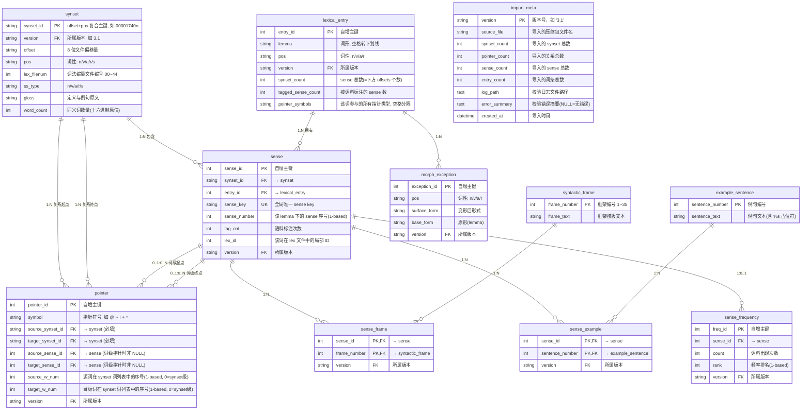

# WordNet SQLite 数据库设计文档

> 目标：将 WordNet 3.1（及后续版本）的 dict/ 纯文本文件无损导入 SQLite，支持增量版本追加。

---

## 一、ER 图



---

## 二、表详细设计

### 2.1 `synset` — 同义词集

| 列 | 类型 | 约束 | 说明 |
|---|---|---|---|
| `synset_id` | TEXT | PK | `offset + pos`，如 `00001740n` |
| `version` | TEXT | NOT NULL | 所属版本号，如 `3.1` |
| `offset` | TEXT | NOT NULL | 8 位文件偏移量，如 `00001740` |
| `pos` | TEXT | NOT NULL | 词性代码，取值: `n`/`v`/`a`/`r`/`s` |
| `lex_filenum` | INTEGER | NOT NULL | 词法编纂文件编号，范围 `00`~`44` |
| `ss_type` | TEXT | NOT NULL | 同义词集类型，取值: `n`/`v`/`a`/`r`/`s` |
| `gloss` | TEXT | NOT NULL | 定义与例句原文（`|` 之后全部内容） |
| `word_count` | INTEGER | NOT NULL | 该 synset 包含的词形数量（十六进制原值，如 `04` → 存 `4`） |

**来源**: `data.noun`, `data.verb`, `data.adj`, `data.adv`

**索引**:
- `idx_synset_version` ON `(version)`
- `idx_synset_offset` ON `(offset, pos)`

**注意**: 同一 `offset` 可能出现在不同 `data.*` 文件中（如 `data.noun` 的 `00001740` 和 `data.verb` 的 `00001740` 是不同的 synset），因此 **必须用 `offset+pos` 作为主键**。

---

### 2.2 `lexical_entry` — 词条（Lemma + POS）

| 列 | 类型 | 约束 | 说明 |
|---|---|---|---|
| `entry_id` | INTEGER | PK, AUTOINCREMENT | 代理主键 |
| `lemma` | TEXT | NOT NULL | 词形（小写，空格→下划线），如 `take_a_breath` |
| `pos` | TEXT | NOT NULL | 词性代码，取值: `n`/`v`/`a`/`r` |
| `version` | TEXT | NOT NULL | 所属版本号 |
| `synset_count` | INTEGER | NOT NULL | 该词条拥有的 sense 总数 |
| `tagged_sense_count` | INTEGER | NOT NULL | 在语料中有标注的 sense 数 |
| `pointer_symbols` | TEXT | NOT NULL | 该词在所有 synset 中参与过的指针类型，空格分隔，如 `@ ~ $ +` |

**来源**: `index.noun`, `index.verb`, `index.adj`, `index.adv`

**唯一约束**: `UNIQUE(lemma, pos, version)` — 同一版本中一个词形+词性组合只出现一次

**索引**:
- `idx_entry_lemma` ON `(lemma, pos, version)`

---

### 2.3 `sense` — 词义（核心关联实体）

| 列 | 类型 | 约束 | 说明 |
|---|---|---|---|
| `sense_id` | INTEGER | PK, AUTOINCREMENT | 代理主键 |
| `synset_id` | TEXT | NOT NULL, FK→synset | 所属 synset |
| `entry_id` | INTEGER | NOT NULL, FK→lexical_entry | 所属词条 |
| `sense_key` | TEXT | UNIQUE NOT NULL | 全局唯一标识，如 `breathe%2:29:00::` |
| `sense_number` | INTEGER | NOT NULL | 该 lemma 下的 sense 序号，从 1 开始 |
| `tag_cnt` | INTEGER | NOT NULL | 在 SemCor 等语料中的标注次数，`0` = 未标注 |
| `lex_id` | INTEGER | NOT NULL | 该词在 lexicographer file 中的局部 ID |
| `version` | TEXT | NOT NULL | 所属版本号 |

**来源**: `index.sense` + `data.*` 中的 word 列表

**Sense Key 编码规则**:
```
lemma%ss_type:lex_filenum:lex_id[:head_word:head_id]
```
- `ss_type`: `1`=n, `2`=v, `3`=a, `4`=r, `5`=s
- `head_word:head_id`: 仅形容词卫星(s)包含，指向核心形容词

**索引**:
- `idx_sense_synset` ON `(synset_id)`
- `idx_sense_entry` ON `(entry_id)`
- `idx_sense_key` UNIQUE ON `(sense_key, version)`

---

### 2.4 `pointer` — 语义关系

| 列 | 类型 | 约束 | 说明 |
|---|---|---|---|
| `pointer_id` | INTEGER | PK, AUTOINCREMENT | 代理主键 |
| `symbol` | TEXT | NOT NULL | 指针符号 |
| `source_synset_id` | TEXT | NOT NULL, FK→synset | 关系起点 synset |
| `target_synset_id` | TEXT | NOT NULL, FK→synset | 关系终点 synset |
| `source_sense_id` | INTEGER | FK→sense(可空) | 源词对应 sense（词级指针时非 NULL） |
| `target_sense_id` | INTEGER | FK→sense(可空) | 目标词对应 sense（词级指针时非 NULL） |
| `source_w_num` | INTEGER | NOT NULL, DEFAULT 0 | 源词在 synset 词列表中的序号（1-based），0=synset级 |
| `target_w_num` | INTEGER | NOT NULL, DEFAULT 0 | 目标词在 synset 词列表中的序号（1-based），0=synset级 |
| `version` | TEXT | NOT NULL | 所属版本号 |

**来源**: `data.*` 每行的指针字段

**指针符号全集**:

| 符号 | 名称 | 适用词性 | 基数 |
|---|---|---|---|
| `!` | ANTONYM | n,v,adj,adv | synset级/词级 |
| `@` | HYPERNYM | n,v | synset级 |
| `@i` | INSTANCE HYPERNYM | n | synset级 |
| `~` | HYPONYM | n,v | synset级 |
| `~i` | INSTANCE HYPONYM | n | synset级 |
| `#m` | MEMBER MERONYM | n | synset级 |
| `#s` | SUBSTANCE MERONYM | n | synset级 |
| `#p` | PART MERONYM | n | synset级 |
| `%m` | MEMBER HOLONYM | n | synset级 |
| `%s` | SUBSTANCE HOLONYM | n | synset级 |
| `%p` | PART HOLONYM | n | synset级 |
| `=` | ATTRIBUTE | n,adj | synset级/词级 |
| `+` | DERIVATION | n,v,adj,adv | 词级 |
| `;c` | DOMAIN CATEGORY | n,v,adj,adv | synset级 |
| `;r` | DOMAIN REGION | n,v,adj,adv | synset级 |
| `;u` | DOMAIN USAGE | n,v,adj,adv | synset级 |
| `-c` | MEMBER CATEGORY | n,v,adj,adv | synset级 |
| `-r` | MEMBER REGION | n,v,adj,adv | synset级 |
| `-u` | MEMBER USAGE | n,v,adj,adv | synset级 |
| `^` | ALSO SEE | v,adj | synset级/词级 |
| `&` | SIMILAR TO | adj | synset级 |
| `\` | PERTAINYM | adj,adv | synset级 |
| `<` | PARTICIPLE | adj | synset级 |
| `*` | ENTAILMENT | v | synset级 |
| `>` | CAUSE | v | synset级 |
| `$` | VERB GROUP | v | synset级 |

**索引**:
- `idx_pointer_source` ON `(source_synset_id)`
- `idx_pointer_target` ON `(target_synset_id)`
- `idx_pointer_symbol` ON `(symbol)`

---

### 2.5 `syntactic_frame` — 动词句法框架

| 列 | 类型 | 约束 | 说明 |
|---|---|---|---|
| `frame_number` | INTEGER | PK | 框架编号，范围 1~35 |
| `frame_text` | TEXT | NOT NULL | 框架模板文本，如 `Somebody ----s something` |

**来源**: `verb.Framestext`

**注意**: 句法框架与版本无关（WN 3.1 的 35 种框架是固定标准），因此不设 version 字段。如果未来版本有新增框架，直接 INSERT OR IGNORE 即可。

---

### 2.6 `sense_frame` — Sense ↔ 句法框架（多对多）

| 列 | 类型 | 约束 | 说明 |
|---|---|---|---|
| `sense_id` | INTEGER | PK, FK→sense | Sense ID |
| `frame_number` | INTEGER | PK, FK→syntactic_frame | 框架编号 |
| `version` | TEXT | NOT NULL | 所属版本号 |

**来源**: `data.verb` 每行末尾的 `f_cnt + frame_num w_num ...` 字段

---

### 2.7 `example_sentence` — 例句文本

| 列 | 类型 | 约束 | 说明 |
|---|---|---|---|
| `sentence_number` | INTEGER | PK | 例句编号 |
| `sentence_text` | TEXT | NOT NULL | 例句文本，`%s` 为动词占位符 |

**来源**: `sents.vrb`

**注意**: 与 `syntactic_frame` 类似，例句库也与版本弱相关，使用 INSERT OR IGNORE。

---

### 2.8 `sense_example` — Sense ↔ 例句（多对多）

| 列 | 类型 | 约束 | 说明 |
|---|---|---|---|
| `sense_id` | INTEGER | PK, FK→sense | Sense ID |
| `sentence_number` | INTEGER | PK, FK→example_sentence | 例句编号 |
| `version` | TEXT | NOT NULL | 所属版本号 |

**来源**: `sentidx.vrb`

---

### 2.9 `morph_exception` — 不规则形态

| 列 | 类型 | 约束 | 说明 |
|---|---|---|---|
| `exception_id` | INTEGER | PK, AUTOINCREMENT | 代理主键 |
| `pos` | TEXT | NOT NULL | 词性: `n`/`v`/`a`/`r` |
| `surface_form` | TEXT | NOT NULL | 变形后的形式，如 `went`、`dogs` |
| `base_form` | TEXT | NOT NULL | 原形(lemma)，如 `go`、`dog` |
| `version` | TEXT | NOT NULL | 所属版本号 |

**来源**: `noun.exc`, `verb.exc`, `adj.exc`, `adv.exc` (以及 `cousin.exc`，如果有内容)

**索引**:
- `idx_exc_surface` ON `(surface_form, pos)`
- `idx_exc_base` ON `(base_form, pos)`

---

### 2.10 `sense_frequency` — 语料频率

| 列 | 类型 | 约束 | 说明 |
|---|---|---|---|
| `freq_id` | INTEGER | PK, AUTOINCREMENT | 代理主键 |
| `sense_id` | INTEGER | NOT NULL, FK→sense | 对应 sense |
| `count` | INTEGER | NOT NULL | 语料中出现次数 |
| `rank` | INTEGER | NOT NULL | 按频率降序排名（1-based） |
| `version` | TEXT | NOT NULL | 所属版本号 |

**来源**: `cntlist`

**索引**:
- `idx_freq_sense` ON `(sense_id)`
- `idx_freq_rank` ON `(rank)`

---

### 2.11 `import_meta` — 版本追踪

| 列 | 类型 | 约束 | 说明 |
|---|---|---|---|
| `version` | TEXT | PK | 版本号，如 `3.1` |
| `source_file` | TEXT | NOT NULL | 源压缩包文件名，如 `wn3.1.dict.tar.gz` |
| `synset_count` | INTEGER | NOT NULL | 导入的 synset 总数 |
| `pointer_count` | INTEGER | NOT NULL | 导入的 pointer 总数 |
| `sense_count` | INTEGER | NOT NULL | 导入的 sense 总数 |
| `entry_count` | INTEGER | NOT NULL | 导入的 lexical_entry 总数 |
| `log_path` | TEXT | — | 校验日志文件路径 |
| `error_summary` | TEXT | — | 校验错误摘要，NULL = 无错误 |
| `created_at` | TEXT | NOT NULL | 导入时间 (ISO 8601) |

---

## 三、数据流映射

```
asset/wn3.1.dict.tar.gz
        │
        ▼ 解压
dict/ 目录
        │
        ├── data.noun ──────► synset (pos=n) + pointer (source/target) + sense (word列表)
        ├── data.verb ──────► synset (pos=v) + pointer + sense + sense_frame (frame段)
        ├── data.adj  ──────► synset (pos=a/s) + pointer + sense
        ├── data.adv  ──────► synset (pos=r) + pointer + sense
        ├── index.noun ─────► lexical_entry (pos=n)
        ├── index.verb ─────► lexical_entry (pos=v)
        ├── index.adj  ─────► lexical_entry (pos=a)
        ├── index.adv  ─────► lexical_entry (pos=r)
        ├── index.sense ────► sense (sense_key, sense_number, tag_cnt)
        ├── cntlist    ─────► sense_frequency
        ├── noun.exc   ─────► morph_exception (pos=n)
        ├── verb.exc   ─────► morph_exception (pos=v)
        ├── adj.exc    ─────► morph_exception (pos=a)
        ├── adv.exc    ─────► morph_exception (pos=r)
        ├── cousin.exc ─────► morph_exception (如果有内容)
        ├── verb.Framestext ─► syntactic_frame
        ├── sentidx.vrb ────► sense_example
        ├── sents.vrb   ────► example_sentence
        └── cntlist.rev ───► (冗余数据，不导入)
```

### 导入顺序（按外键依赖）

```
1. syntactic_frame      (无依赖)
2. example_sentence     (无依赖)
3. synset               (无依赖)
4. lexical_entry        (无依赖)
5. sense                (FK→synset, FK→lexical_entry, 需先有 index.sense 提供 sense_key)
6. pointer              (FK→synset×2, FK→sense×2)
7. sense_frame          (FK→sense, FK→syntactic_frame)
8. sense_example        (FK→sense, FK→example_sentence)
9. morph_exception      (无强依赖)
10. sense_frequency     (FK→sense)
```

---

## 四、校验策略

### 4.1 行数校验

每个文件解析的总行数与数据库对应表的写入行数对比：

| 文件 | 校验目标 | 预期计数 |
|---|---|---|
| `data.noun` | `SELECT COUNT(*) FROM synset WHERE pos='n'` | = 文件非注释行数 |
| `data.verb` | `SELECT COUNT(*) FROM synset WHERE pos='v'` | = 文件非注释行数 |
| `data.adj` | `SELECT COUNT(*) FROM synset WHERE pos IN ('a','s')` | = 文件非注释行数 |
| `data.adv` | `SELECT COUNT(*) FROM synset WHERE pos='r'` | = 文件非注释行数 |
| `index.noun` | `SELECT COUNT(*) FROM lexical_entry WHERE pos='n'` | = 文件行数 |
| `index.verb` | `SELECT COUNT(*) FROM lexical_entry WHERE pos='v'` | = 文件行数 |
| `index.adj` | `SELECT COUNT(*) FROM lexical_entry WHERE pos='a'` | = 文件行数 |
| `index.adv` | `SELECT COUNT(*) FROM lexical_entry WHERE pos='r'` | = 文件行数 |
| `index.sense` | `SELECT COUNT(*) FROM sense` | = 文件行数 |
| `cntlist` | `SELECT COUNT(*) FROM sense_frequency` | = 文件行数 |
| `*.exc` (合计) | `SELECT COUNT(*) FROM morph_exception` | = 四文件行数之和 |
| `sentidx.vrb` | `SELECT COUNT(*) FROM sense_example` | = 文件行数 |

### 4.2 引用完整性校验

```sql
-- Pointer source 引用完整性
SELECT COUNT(*) FROM pointer
WHERE source_synset_id NOT IN (SELECT synset_id FROM synset);

-- Pointer target 引用完整性
SELECT COUNT(*) FROM pointer
WHERE target_synset_id NOT IN (SELECT synset_id FROM synset);

-- Sense → Synset 引用完整性
SELECT COUNT(*) FROM sense
WHERE synset_id NOT IN (SELECT synset_id FROM synset);

-- Sense → LexicalEntry 引用完整性
SELECT COUNT(*) FROM sense
WHERE entry_id NOT IN (SELECT entry_id FROM lexical_entry);
```

### 4.3 全局统计校验

| 指标 | WordNet 3.1 官方值 | 校验 SQL |
|---|---|---|
| Synset 总计 | 117,791 | `SELECT COUNT(*) FROM synset WHERE version='3.1'` |
| Pointer 总计 | 225,204 | `SELECT COUNT(*) FROM pointer WHERE version='3.1'` |
| Sense 总计 | 207,272 | `SELECT COUNT(*) FROM sense WHERE version='3.1'` |
| 唯一词形 | ~147,478 | `SELECT COUNT(DISTINCT lemma) FROM lexical_entry WHERE version='3.1'` |

### 4.4 日志输出

所有校验结果写入 `db/import_<version>.log`，格式：

```
===== WordNet 3.1 导入校验报告 =====
导入时间: 2026-06-02 15:00:00

--- 行数校验 ---
data.noun: 文件 82192 行 → 数据库 82192 行 [PASS]
data.verb: 文件 13789 行 → 数据库 13789 行 [PASS]
...

--- 引用完整性 ---
Pointer source_synset_id: 0 孤立引用 [PASS]
Pointer target_synset_id: 0 孤立引用 [PASS]
...

--- 全局统计 ---
Synset 总数: 117791 (预期 117791) [PASS]
Pointer 总数: 225204 (预期 225204) [PASS]
...

===== 结果: ALL PASS =====
```

有任何 FAIL 项目会在日志中详细列出差异数据。

---

## 五、版本兼容性

### 5.1 已兼容的文件格式（WN 3.1 当前）

所有文件格式在 wordnet 3.0/3.1 中保持稳定。Princeton 的 grind 编译器生成的 `data.*`, `index.*`, `index.sense`, `cntlist`, `*.exc`, `verb.Framestext`, `sentidx.vrb`, `sents.vrb` 格式自 2006 年以来未变动。

### 5.2 未来版本（WN 3.2+）的兼容策略

- 新版本通过 `version` 字段追加到同一数据库，不破坏已有数据
- 如果未来版本新增指针符号，`pointer.symbol` 列接受任意字符串，无需改表结构
- 如果新增文件类型（如新的 exc 文件），导入器自动扫描 `dict/` 目录发现并处理
- `import_meta` 表保证同一版本不会被重复导入
